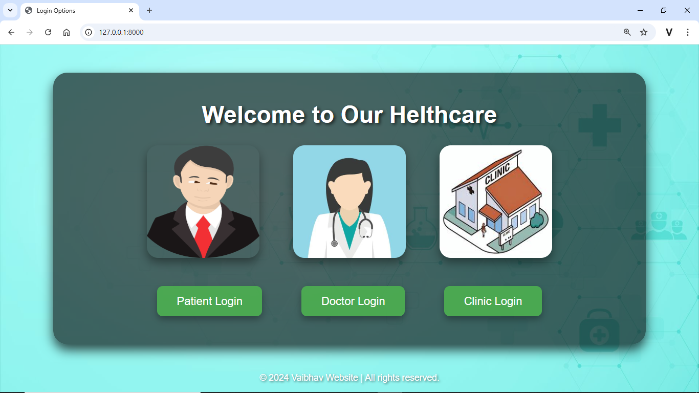
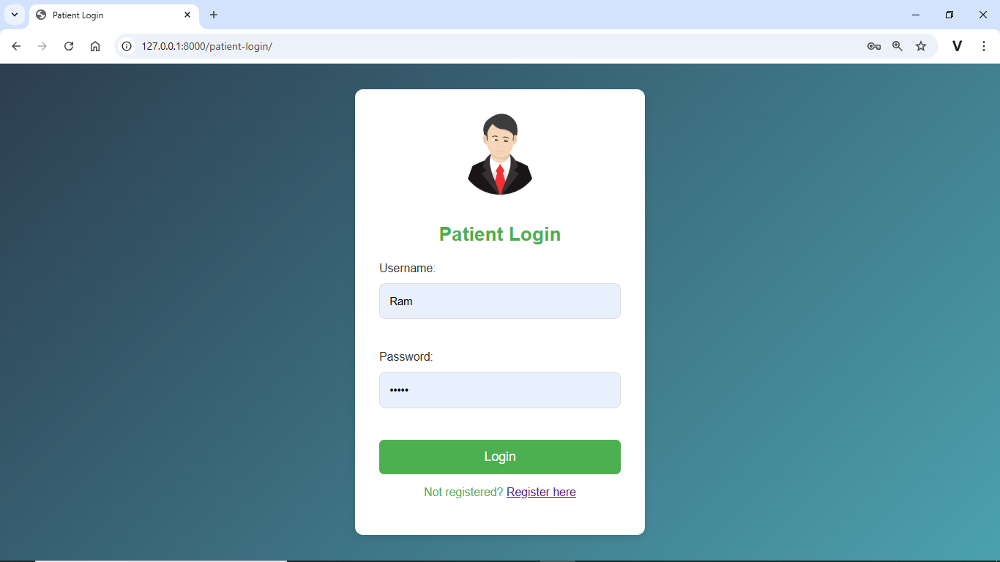
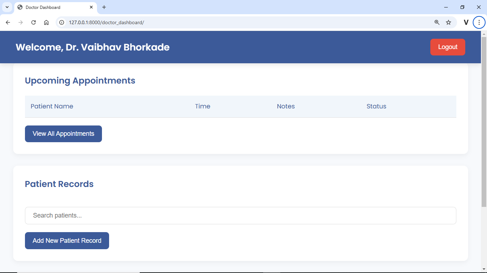

# Healthcare-Management-System-using-Django
This project is a comprehensive web-based solution designed to healthcare management for clinics, doctors, and patients using Django, it features:

- **Role-based Access**: Separate login and dashboards for doctors, clinics, and patients.
- **User Management**: Registration and Login for patients, doctors, and clinics.
- **Appointment Scheduling**: Patients can book appointments with doctors and can view/manage appointments.
- **Profile Management**: Patients and doctors can manage their profiles and view relevant details.
  
### Key Features
1. **Patient Dashboard**: View profile, manage appointments, and check appointment history.
2. **Doctor Dashboard**: Manage personal details and access appointment information.
3. **Clinic Dashboard**: Monitor doctors, patients, and scheduled appointments.
4. **Appointment API**: Schedule appointments via an API endpoint.

### Technologies Used
- **Framework**: Django
- **Database**: PostgreSQL
- **Frontend**: HTML/CSS for templates

Here are some screenshots of the project:

|  |  |
|---------------------------------------|---------------------------------------|
|  |  |
|  |  |
|  |  |
|  |  |
